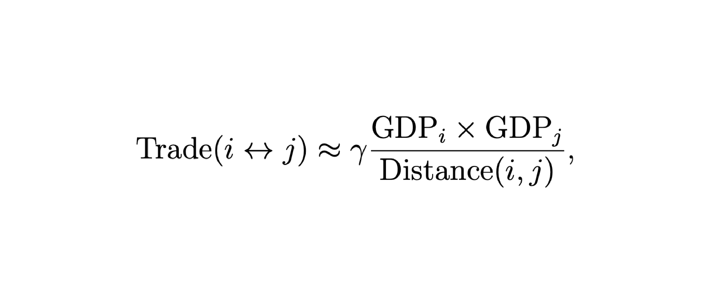
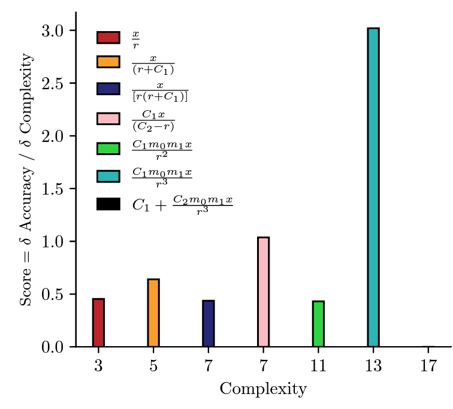
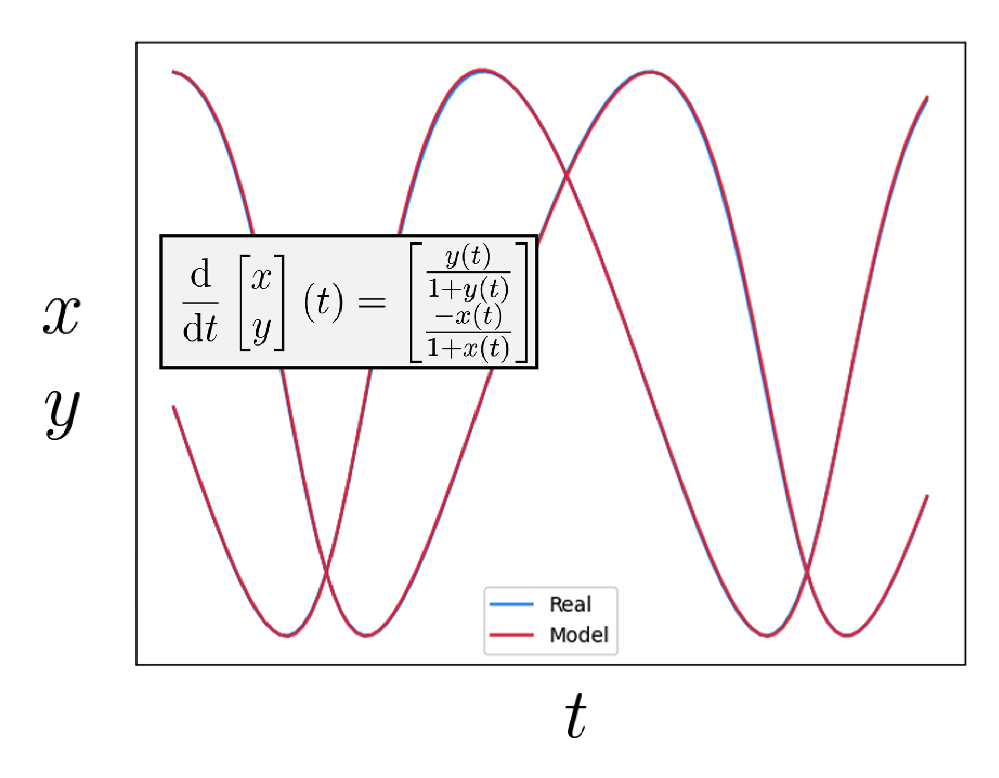
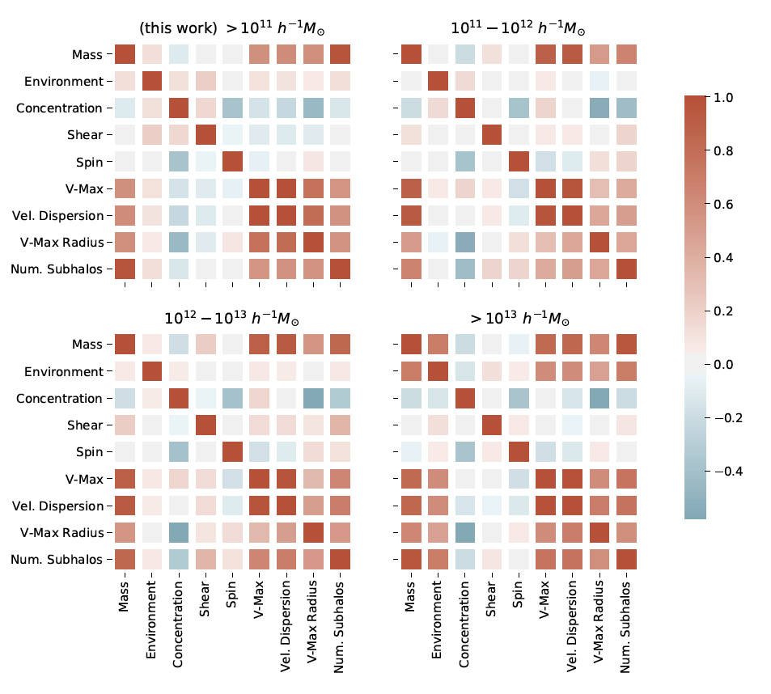
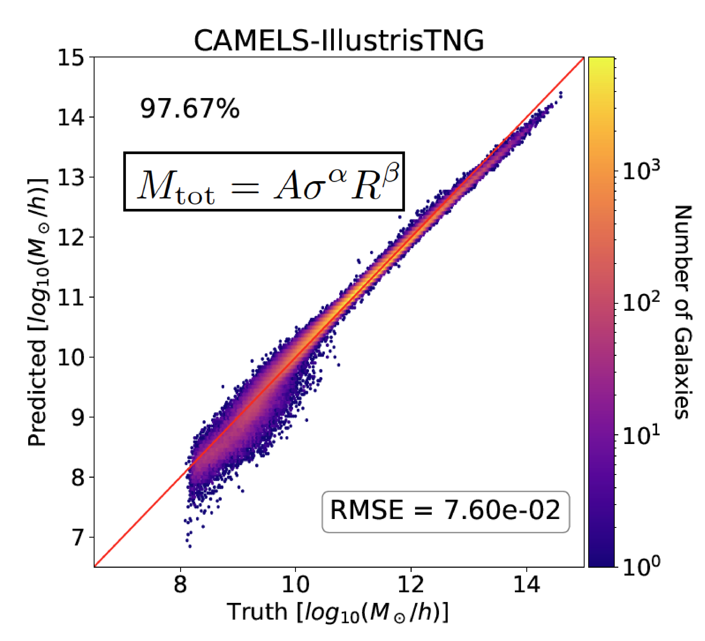
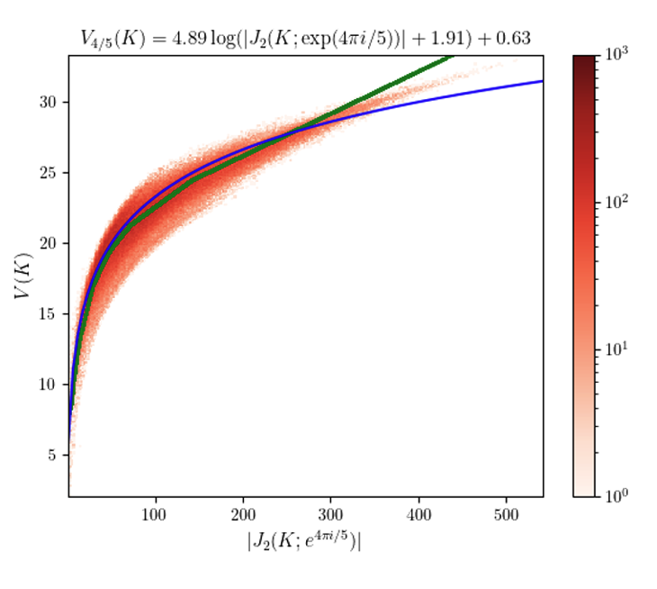

# PySR Showcase
Below is a showcase of papers which have used PySR to discover
or rediscover a symbolic model.
These are sorted by the date of release, with most recent papers at the top.

If you have used PySR in your research,
please submit a pull request to add your paper to [this file](https://github.com/MilesCranmer/PySR/blob/master/docs/papers.yml).

<!-- Text column: -->

<a href="https://papers.ssrn.com/abstract=4053795">Machine Learning the Gravity Equation for International Trade</a> Sergiy Verstyuk 1, Michael R. Douglas 1 <small>1Harvard University</small> 

**Abstract:** Machine learning (ML) is becoming more and more important throughout the mathematical and theoretical sciences. In this work we apply modern ML methods to gravity models of pairwise interactions in international economics. We explain the formulation of graphical neural networks (GNNs), models for graph-structured data that respect the properties of exchangeability and locality. GNNs are a natural and theoretically appealing class of models for international trade, which we demonstrate empirically by fitting them to a large panel of annual-frequency country-level data. We then use a symbolic regression algorithm to turn our fits into interpretable models with performance comparable to state of the art hand-crafted models motivated by economic theory. The resulting symbolic models contain objects resembling market access functions, which were developed in modern structural literature, but in our analysis arise ab initio without being explicitly postulated. Along the way, we also produce several model-consistent and model-agnostic ML-based measures of bilateral trade accessibility.

<!-- Image column: -->

<!-- Text column: -->

<a href="https://arxiv.org/abs/2202.02306">Rediscovering orbital mechanics with machine learning</a> Pablo Lemos 1,2, Niall Jeffrey 3,2, Miles Cranmer 4, Shirley Ho 4,5,6,7, Peter Battaglia 8 <small>1University of Sussex, 2University College London, 3ENS, 4Princeton University, 5Flatiron Institute, 6Carnegie Mellon University, 7New York University, 8DeepMind</small> 

**Abstract:** We present an approach for using machine learning to automatically discover the governing equations and hidden properties of real physical systems from observations. We train a "graph neural network" to simulate the dynamics of our solar system's Sun, planets, and large moons from 30 years of trajectory data. We then use symbolic regression to discover an analytical expression for the force law implicitly learned by the neural network, which our results showed is equivalent to Newton's law of gravitation. The key assumptions that were required were translational and rotational equivariance, and Newton's second and third laws of motion. Our approach correctly discovered the form of the symbolic force law. Furthermore, our approach did not require any assumptions about the masses of planets and moons or physical constants. They, too, were accurately inferred through our methods. Though, of course, the classical law of gravitation has been known since Isaac Newton, our result serves as a validation that our method can discover unknown laws and hidden properties from observed data. More broadly this work represents a key step toward realizing the potential of machine learning for accelerating scientific discovery.

<!-- Image column: -->

<!-- Text column: -->

<a href="https://arxiv.org/abs/2202.02435">(Thesis) On Neural Differential Equations - Section 6.1</a> Patrick Kidger 1 <small>1University of Oxford</small> 

**Abstract:** The conjoining of dynamical systems and deep learning has become a topic of great interest. In particular, neural differential equations (NDEs) demonstrate that neural networks and differential equation are two sides of the same coin. Traditional parameterised differential equations are a special case. Many popular neural network architectures, such as residual networks and recurrent networks, are discretisations. NDEs are suitable for tackling generative problems, dynamical systems, and time series (particularly in physics, finance, ...) and are thus of interest to both modern machine learning and traditional mathematical modelling. NDEs offer high-capacity function approximation, strong priors on model space, the ability to handle irregular data, memory efficiency, and a wealth of available theory on both sides. This doctoral thesis provides an in-depth survey of the field. Topics include: neural ordinary differential equations (e.g. for hybrid neural/mechanistic modelling of physical systems); neural controlled differential equations (e.g. for learning functions of irregular time series); and neural stochastic differential equations (e.g. to produce generative models capable of representing complex stochastic dynamics, or sampling from complex high-dimensional distributions). Further topics include: numerical methods for NDEs (e.g. reversible differential equations solvers, backpropagation through differential equations, Brownian reconstruction); symbolic regression for dynamical systems (e.g. via regularised evolution); and deep implicit models (e.g. deep equilibrium models, differentiable optimisation). We anticipate this thesis will be of interest to anyone interested in the marriage of deep learning with dynamical systems, and hope it will provide a useful reference for the current state of the art.

<!-- Image column: -->

<!-- Text column: -->

<a href="https://arxiv.org/abs/2111.02422v1">Modeling the galaxy-halo connection with machine learning</a> Ana Maria Delgado 1, Digvijay Wadekar 2,3, Boryana Hadzhiyska 1, Sownak Bose 1,7, Lars Hernquist 1, Shirley Ho 2,4,5,6 <small>1Center for Astrophysics | Harvard & Smithsonian, 2New York University, 3Institute for Advanced Study, 4Flatiron Institute, 5Princeton University, 6Carnegie Mellon University, 7Durham University</small> 

**Abstract:** To extract information from the clustering of galaxies on non-linear scales, we need to model the connection between galaxies and halos accurately and in a flexible manner. Standard halo occupation distribution (HOD) models make the assumption that the galaxy occupation in a halo is a function of only its mass, however, in reality, the occupation can depend on various other parameters including halo concentration, assembly history, environment, spin, etc. Using the IllustrisTNG hydrodynamic simulation as our target, we show that machine learning tools can be used to capture this high-dimensional dependence and provide more accurate galaxy occupation models. Specifically, we use a random forest regressor to identify which secondary halo parameters best model the galaxy-halo connection and symbolic regression to augment the standard HOD model with simple equations capturing the dependence on those parameters, namely the local environmental overdensity and shear, at the location of a halo. This not only provides insights into the galaxy-formation relationship but, more importantly, improves the clustering statistics of the modeled galaxies significantly. Our approach demonstrates that machine learning tools can help us better understand and model the galaxy-halo connection, and are therefore useful for galaxy formation and cosmology studies from upcoming galaxy surveys.

<!-- Image column: -->

<!-- Text column: -->

<a href="https://arxiv.org/abs/2109.10414">Back to the Formula -- LHC Edition</a> Anja Butter 1, Tilman Plehn 1, Nathalie Soybelman 1, Johann Brehmer 2 <small>1Institut fur Theoretische Physik, Universitat Heidelberg, 2Center for Data Science, New York University</small> 

**Abstract:** While neural networks offer an attractive way to numerically encode functions, actual formulas remain the language of theoretical particle physics. We show how symbolic regression trained on matrix-element information provides, for instance, optimal LHC observables in an easily interpretable form. We introduce the method using the effect of a dimension-6 coefficient on associated ZH production. We then validate it for the known case of CP-violation in weak-boson-fusion Higgs production, including detector effects.

<!-- Image column: -->

<!-- Text column: -->

<a href="https://arxiv.org/abs/2109.04484v1">Finding universal relations in subhalo properties with artificial intelligence</a> Helen Shao 1, Francisco Villaescusa-Navarro 1,2, Shy Genel 2,3, David N. Spergel 2,1, Daniel Angles-Alcazar 4,2, Lars Hernquist 5, Romeel Dave 6,7,8, Desika Narayanan 9,10, Gabriella Contardo 2, Mark Vogelsberger 11 <small>1Princeton University, 2Flatiron Institute, 3Columbia University, 4University of Connecticut, 5Center for Astrophysics | Harvard & Smithsonian, 6University of Edinburgh, 7University of the Western Cape, 8South African Astronomical Observatories, 9University of Florida, 10University of Florida Informatics Institute, 11MIT</small> 

**Abstract:** We use a generic formalism designed to search for relations in high-dimensional spaces to determine if the total mass of a subhalo can be predicted from other internal properties such as velocity dispersion, radius, or star-formation rate. We train neural networks using data from the Cosmology and Astrophysics with MachinE Learning Simulations (CAMELS) project and show that the model can predict the total mass of a subhalo with high accuracy: more than 99% of the subhalos have a predicted mass within 0.2 dex of their true value. The networks exhibit surprising extrapolation properties, being able to accurately predict the total mass of any type of subhalo containing any kind of galaxy at any redshift from simulations with different cosmologies, astrophysics models, subgrid physics, volumes, and resolutions, indicating that the network may have found a universal relation. We then use different methods to find equations that approximate the relation found by the networks and derive new analytic expressions that predict the total mass of a subhalo from its radius, velocity dispersion, and maximum circular velocity. We show that in some regimes, the analytic expressions are more accurate than the neural networks. We interpret the relation found by the neural network and approximated by the analytic equation as being connected to the virial theorem.

<!-- Image column: -->

<!-- Text column: -->

<a href="https://link.springer.com/article/10.1007/JHEP06(2021)040">Disentangling a deep learned volume formula</a> Jessica Craven 1, Vishnu Jejjala 1, Arjun Kar 2 <small>1University of the Witwatersrand, 2University of British Columbia</small> 

**Abstract:** We present a simple phenomenological formula which approximates the hyperbolic volume of a knot using only a single evaluation of its Jones polynomial at a root of unity. The average error is just 2.86% on the first 1.7 million knots, which represents a large improvement over previous formulas of this kind. To find the approximation formula, we use layer-wise relevance propagation to reverse engineer a black box neural network which achieves a similar average error for the same approximation task when trained on 10% of the total dataset. The particular roots of unity which appear in our analysis cannot be written as e2πi/(k+2) with integer k; therefore, the relevant Jones polynomial evaluations are not given by unknot-normalized expectation values of Wilson loop operators in conventional SU(2) Chern-Simons theory with level k. Instead, they correspond to an analytic continuation of such expectation values to fractional level. We briefly review the continuation procedure and comment on the presence of certain Lefschetz thimbles, to which our approximation formula is sensitive, in the analytically continued Chern-Simons integration cycle.

<!-- Image column: -->

040)

<!-- Text column: -->

<a href="https://arxiv.org/abs/2012.00111">Modeling assembly bias with machine learning and symbolic regression</a> Digvijay Wadekar 1, Francisco Villaescusa-Navarro 2,3, Shirley Ho 2,3,4, Laurence Perreault-Levasseur 3,5,6 <small>1New York University, 2Princeton University, 3Flatiron Institute, 4Carnegie Mellon University, 5Université de Montréal, 6Mila</small> 

**Abstract:** Upcoming 21cm surveys will map the spatial distribution of cosmic neutral hydrogen (HI) over unprecedented volumes. Mock catalogues are needed to fully exploit the potential of these surveys. Standard techniques employed to create these mock catalogs, like Halo Occupation Distribution (HOD), rely on assumptions such as the baryonic properties of dark matter halos only depend on their masses. In this work, we use the state-of-the-art magneto-hydrodynamic simulation IllustrisTNG to show that the HI content of halos exhibits a strong dependence on their local environment. We then use machine learning techniques to show that this effect can be 1) modeled by these algorithms and 2) parametrized in the form of novel analytic equations. We provide physical explanations for this environmental effect and show that ignoring it leads to underprediction of the real-space 21-cm power spectrum at k≳0.05 h/Mpc by ≳10%, which is larger than the expected precision from upcoming surveys on such large scales. Our methodology of combining numerical simulations with machine learning techniques is general, and opens a new direction at modeling and parametrizing the complex physics of assembly bias needed to generate accurate mocks for galaxy and line intensity mapping surveys.

<!-- Image column: -->

